<h1 align="center">Catan Board Generator</h1>
Tired of wasting your time trying to set up a unique, well-balanced board before your games of Catan? This website uses algorithms to generate random well-balanced (or very poorly-balanced, if you desire) Catan boards in seconds!

<a href="https://ivanovich.us/portfolio" target="_blank">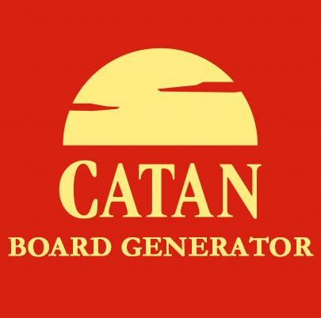 </a>

This project was made and submitted to the College Board as my "create task" for the AP Computer Science Principles course.

<h2 align="center">About Catan</h2>
This is a Catan board:

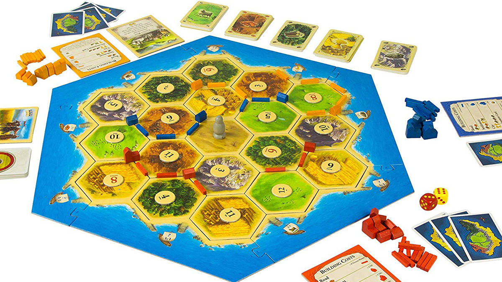

Clearly, there is quite a lot to a board. Every hexagonal tile can be one of 6 terrains: mountains, forests, fields, pastures, hills, and deserts. Every terrain hex type produces its own resource type, excluding the desert, which produces nothing. There are also number tiles for all non-desert terrain hexes. The terrain hexes and number tiles can be laid out in any way in any game, either randomly or, more typically, by the players' design.

<h2 align="center">The Problem</h2>
Setting up a Catan board is a long process made even longer by desires to make a board that is fair to all players. In addition, the fairness of a Catan board itself is incredibly hard to analyze without guesswork, especially by human players within reasonable time. When a "balanced" layout is found, the difficulty of this process encourages players to use the same layout repeatedly across different games, decreasing variety and game enjoyment. **How can Catan players make balanced boards quickly while having their boards differ from game to game to maintain variety?**

<h2 align="center">The Solution: Catan Board Generator</h3>
Catan Board Generator is a website that generates random very balanced Catan board layouts. If the user desires for some twisted reason to play on a hilariously-unbalanced Catan board, Catan Board Generator can also generate random incredibly-unbalanced boards. The Python webserver uses an **original algorithm to evaluate the balance of the complex Catan boards across 5 factors** in order to generate and evaluate the outputted boards. Boards are scored between 0 and 1, with 0 being the most balanced (the closest boards will typically get is around 0.04) and 1 being the most unbalanced (the closest boards will typically get is around 0.62). 

This algorithm is [broken down in detail below](#deep-dive-board-balance-scoring-algorithm).

<h2 align="center">Features</h3>

* Built from the ground-up following the principles of **object-oriented design**
* Thorough board balance evaluation algorithm built upon **5 factors**:
  * Resource distribution
  * Resource clustering
  * Probability clustering
  * Probability distribution per resource
  * Probability distribution on board
* **Test-driven development**: thorough test system to evaluate each factor on several known layouts
* Flask-based web server with minimalistic interface
  * Clear, vector-graphic interface of generated board layout

<h2 align="center">Deep Dive: Board Balance Scoring Algorithm</h2>

The board balance evaluation algorithm is built upon **5 distinct factors** that are combined into a final score between 0 and 1, where 0 represents the most balanced board and 1 represents the least balanced board. 

Typical ranges of this final score are [detailed above](#the-solution-catan-board-generator).

<h3 align="center">Resource Distribution</h3>
When measuring distribution across the board, the symmetry of the shape of a Catan board was utilized. Three lines through the center of the board that do not cross any valid settlement locations can be drawn as follows:

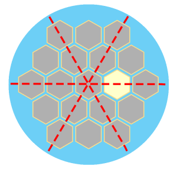

We will refer to these lines as the "dividing lines." These were used in the resource distribution scoring algorithm. For each dividing line, the algorithm examines all possible settlement positions and counts the frequency of the 1-3 terrain types accessible at that position. For each resource type, the frequencies on each side of the line are summed, then the sums on one side of the dividing line are subtracted from the sum on the other side of the line. The differences are squared, then these squares are summed.

For example, here is what the process would look like for the horizontal dividing line for forest terrain hexes:

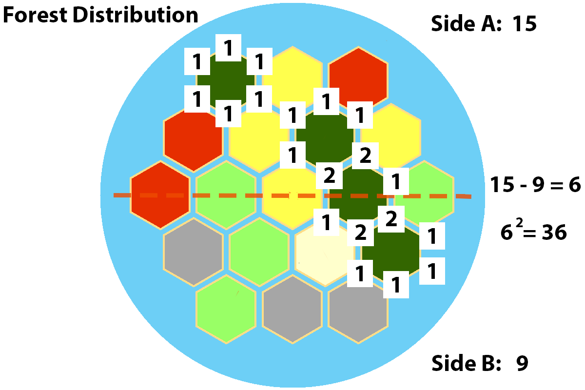

Here are what the resource distribution scores would look like for various boards, illustrating how the algorithm properly scores resource distribution for balance:

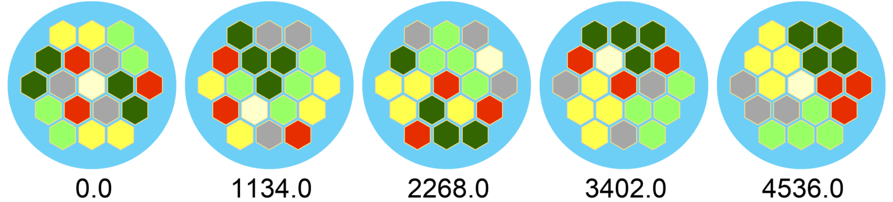

<i>The lower the score, the more balanced the algorithm has deemed the board to be.</i>

<h3 align="center">Probability Distribution on Board</h3>
This algorithm is similar to the resource distribution algorithm, using the same three dividing lines. For each dividing line, this algorithm also considers every possible settlement location, summing the relative likelihoods of the 0-3 number tiles accessible from that location. Again, the scores are summed for each side of the dividing line, then the difference between the halves is squared and these squares are summed.

Here are what the probability distribution scores would look like for various boards, illustrating how the algorithm properly scores probability distribution for balance:

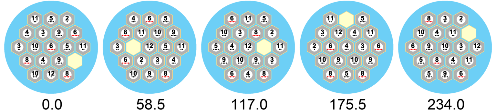

<i>The lower the score, the more balanced the algorithm has deemed the board to be.</i>

<h3 align="center">Resource Clustering</h3>
Resource clustering is a far simpler algorithm, adding points for every edge that two resources of identical types share. Here are what the resource clustering scores would look like for various boards, illustrating how the algorithm properly scores resource clustering for balance:

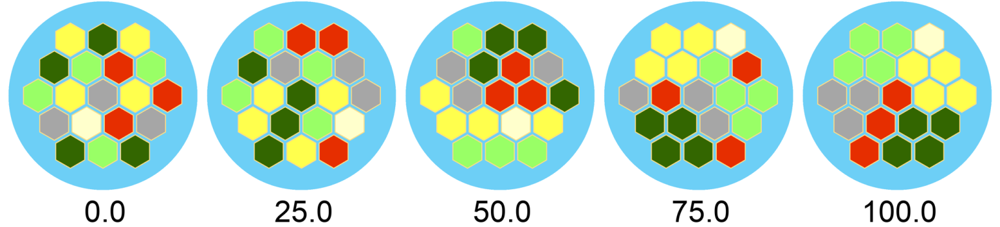

<i>Again, the lower the score, the more balanced the algorithm has deemed the board to be.</i>

<h3 align="center">Probability Clustering</h3>
Probability clustering is analyzed by a similar algorithm, adding points for every edge shared by two terrain hexes with the same number tile. Here are what the probability clustering scores would look like for various boards, illustrating how the algorithm properly scores probability clustering for balance:

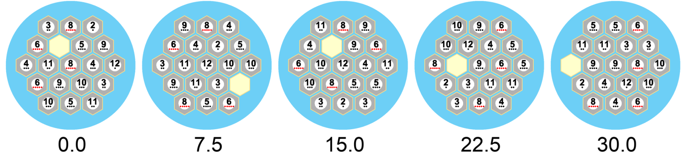

<i>You get the drill, lower is better.</i>

<h3 align="center">Probability Distribution Per Resource</h3>
The fifth and final factor used to score a board's balance analyzes the probability distribution per resource. This algorithm was built to ensure **resources have a total probability of paying out proportional to their presence on the board.** In short, it takes the difference between the expected and actual payout probabilities for each resource type, squares the differences, then sums the squares.

Here are what the probability distribution per resource scores would look like for various boards, illustrating how the algorithm properly scores probability distribution for balance:

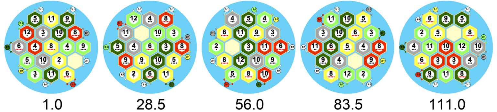

<i>As always, lower is better.</i>

<h3 align="center">Putting It All Together</h3>
These 5 aforementioned factors are scaled down between 0 and 1 using their highest expected individual scores, then these scaled-down results are averaged with uniform weighting to provide the final 0-to-1 score.

When a user asks the server to generate a balanced (or unbalanced) board, the server generates several thousand random boards, scores them, and shows the user the most (or least) balanced board that it generated. Thus, **although not every board generated will be the theoretically most-balanced board possible, they will all be fairly close to this bound while continuing to vary with every generation, letting future games still be interesting.**

*Methodology inspired by and images from [Board Game Analysis](https://www.boardgameanalysis.com)*

<h2 align="center">Screenshots</h2>

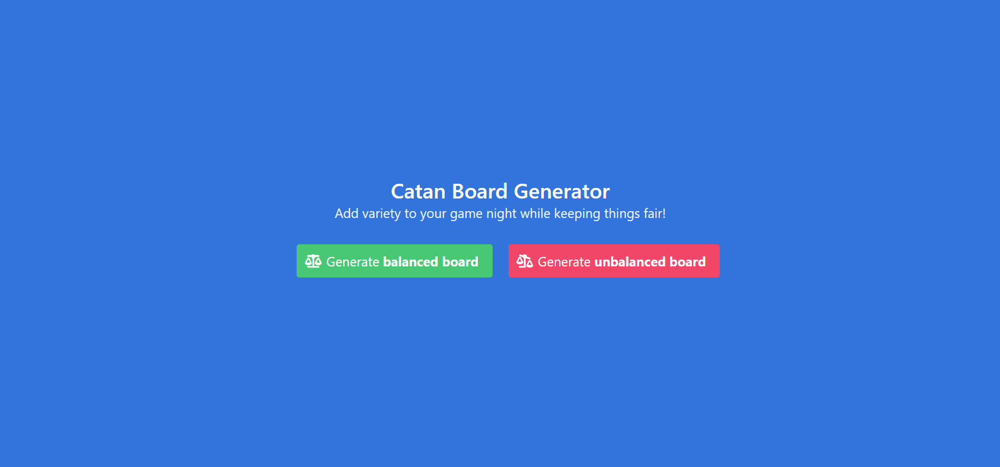

<i>The home page of the interface</i>

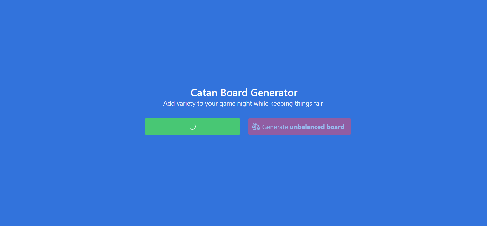

<i>The page displays a loading animation as it generates a balanced board</i>

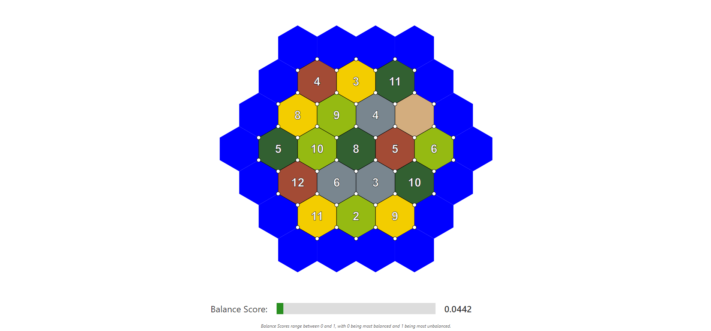

<i>The user is redirected to a page displaying the generated board and its associated balance score. This board scored 0.0442, meaning it is very well-balanced. A cursory glance makes it clear why this is the case - there are several equally-good starting positions available.</i>

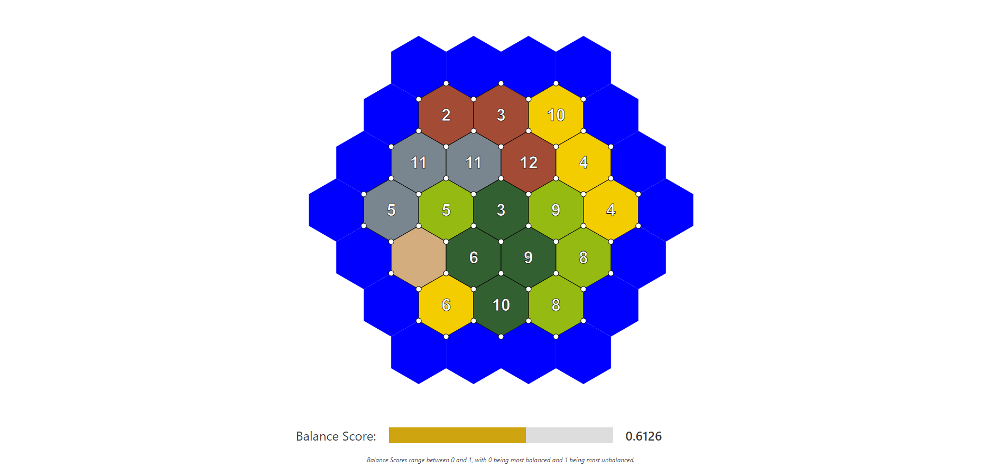

<i>The result if the user asked for an unbalanced board. This board scored 0.6126, meaning it is very unbalanced. It's clear why this is - terrain types are clustered together, as are the best number tiles.</i>

The pages with the generated boards are populated via GET parameters, which would allow a player to bookmark/save a board they like or share the generated board with other players simply via URL.

I hope to host a demo of this project in the near future on some sort of free hosting service, so that I and other Catan players may use it in their game nights. I may end up turning the demo into a static site that chooses from a pre-generated, large list of potential boards. This would be less-than-ideal and a waste of the capabilities of the Python backend, but easy to find *free*, good-quality hosting for, which will likely be the dominating factor. The required changes to the source code will be made in a separate branch when this happens.
